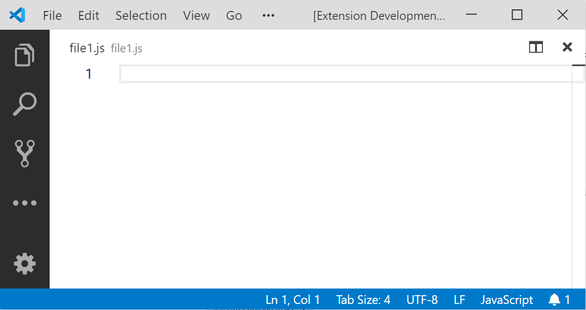

**Hot Snippet** is a Visual Studio Code extension that helps quickly insert [user-defined snippets](https://code.visualstudio.com/docs/editor/userdefinedsnippets).

This extension aims to solve the problem that adding a snippet from [IntelliSense](https://code.visualstudio.com/docs/editor/intellisense) menu is _too slow to show up_. Developers who have fast-typing pace might get annoyed by the slowness of IntelliSense menu, especially in a big repository.

## Basic usage

As soon as the extension is activated, it automatically sets `editor.snippetSuggestions` to `"off"` at user-level settings. This avoids redundant snippet suggestions offered by IntelliSense menu.

The extension reads your [global-scoped](https://code.visualstudio.com/docs/editor/userdefinedsnippets) and [project-scoped snippets](https://code.visualstudio.com/docs/editor/userdefinedsnippets#_project-snippet-scope) and monitors your keystrokes; whenever the key sequence matches the `prefix` defined in the user snippets (_File > Preferences > User Snippets_) followed by a **space** key, it replaces the prefix with the matching snippet.

For example, given the below JavaScript snippet template, you can quickly type `cs`, `fx`, and `lg` to generate `const`, `function`, and `console.log()` respectively.

```jsonc
// See also https://code.visualstudio.com/docs/editor/userdefinedsnippets
{
  "const": {
    "prefix": "cs",
    "body": "const "
  },
  "function": {
    "prefix": "fx",
    "body": ["function($1) {", "\t$0", "}"]
  },
  "log": {
    "prefix": "lg",
    "body": "console.log($0)"
  }
}
```


